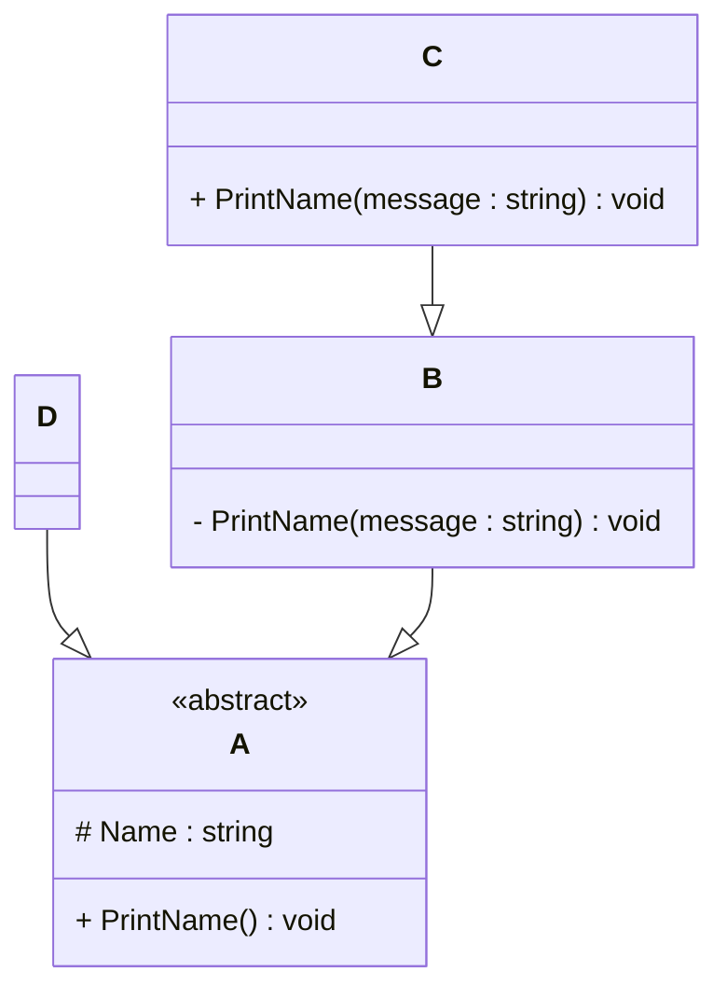

# Programming Test

This test was composed to create a general overview of your knowledge regarding general programming and how it fits with the needs in our lab. Please try to answer all questions using your own knowledge and in your own words. If you get stuck on one of the exercises, still try to give a short answer.

---

## Exercise 1

### Task
Write a program in the language of your choice where:

1. The iteration number (starting from 1), followed by a random number between 1 and 100, is printed 100 times.
2. After every 5 iterations, write an additional separator (e.g., `---`).
3. Write “Lucky number!” after every random number that is divisible by 7.

> Try to keep the procedure as short as possible.

import java.util.Random;
public class Main {
    public static void main(String[] args) {
        Random random = new Random();
        for (int i = 1; i <= 100; i++) {
            int number = random.nextInt(100) + 1;
            System.out.print("Iteration " + i + ": " + number);
            if (number % 7 == 0) {
                System.out.print(" - Lucky number!");
            }
            System.out.println();
            if (i % 5 == 0) {
                System.out.println("---");
            }
        }
    }
}

---

## Exercise 2

### 1. **What is your understanding of the term “Design Patterns”?**  
   Provide a description in your own words.
 blueprints that developers have identified and shared, based on patterns that work well in certain scenarios .

### 2. **Explain the MVC Pattern**  
   - What does MVC stand for? 
Model View Controller 
   - Explain the pattern in detail.  
   Model:
This is the part of the application that handles the data and business logic. It communicates with the database and contains the rules for how the data can be created, stored, and modified.

   View:
The View is responsible for displaying the data provided by the Model in a user-friendly way. It is the interface the user interacts with, such as web pages or forms.

   Controller:
The Controller acts as a middleman between the Model and the View. It receives input from the user via the View, processes it (often involving the Model), and then updates the View accordingly.
   
- What are some use cases for this framework?
Web development frameworks like Spring MVC (Java), ASP.NET MVC (C#).
Desktop applications using JavaFX or Swing with an MVC structure.
Mobile apps Android apps.

### 3. **List three other design patterns**  
   - Provide names and details for three additional design patterns.
 Singleton Pattern
 Observer Pattern
 Factory Pattern
   - Explain how you have used those patterns in the past and how they have solved your problem  
Factory Pattern : It simplified object creation and improved scalability. Adding new notification types was easy without changing existing code.
Observer Pattern : It kept the UI synchronized with the data model without requiring manual updates in every part of the interface.
Singleton : It ensured that only one connection was created and reused across the app, improving performance and consistency.
   - Use diagrams to explain the design patterns.
      --------------------------------------------------
          Singleton      
       +------------------+
         - instance       
         + getInstance()  
       +------------------+
               |
               v
       +------------------+
         single object    
-----------------------------------------------

+------------+        notify()       +-------------+
   Subject     -------------------->   Observer 1  
+------------+                       +-------------+
       |                             +-------------+
       |-------- notify() --------->   Observer 2  
                                     +-------------+

--------------------------------------------------------
     +------------------+
      NotificationFactory 
     +------------------+
       + create(type)    
     +------------------+
              |
   ------------------------
   |          |           |
   v          v           v
Email     SMS       PushNotification

---

## Exercise 3

### 1. **Implementation Task**  
   Based on the class diagram below, provide an implementation in any object-oriented programming language of your choice.
   

### 2. **Key Questions**  
   - Are you able to directly create a new instance of `ObjectA`? Please explain your answer.  
If ObjectA is an abstract class or an interface, you cannot instantiate it directly. This is because abstract classes and interfaces are meant to provide a blueprint for subclasses, not to create standalone objects.
If ObjectA is a concrete class (i.e., not abstract and has a public constructor), then you can create an instance using new ObjectA().
If the constructor of ObjectA is private or protected, instantiation from outside its class or package may be disallowed.
   - Given an instance of `ObjectC`, are you able to call the method `PrintMessage` defined in `ObjectB`? Please explain your answer.  
 Given an instance of ObjectC, are you able to call the method PrintMessage defined in ObjectB? Please explain your answer.
This depends on the relationship between ObjectC and ObjectB:
If ObjectC inherits from ObjectB, and the method PrintMessage is declared as public or protected, then yes, you can call PrintMessage on an ObjectC instance directly, because the method is inherited.
If ObjectC contains an instance of ObjectB (composition), then you must access it through the member reference, e.g., objectC.b.PrintMessage(), where b is a member of type ObjectB.
If ObjectC has no relation to ObjectB, you cannot call PrintMessage on ObjectC.
   - Try to explain as many key features of object-oriented programming as you can find in this example.
Encapsulation: Data (fields) and behavior (methods) are bundled inside classes like ObjectA, ObjectB, and ObjectC, controlling access through modifiers like private, protected, and public.
Inheritance: Classes inherit properties and methods from parent classes ObjectC inherits from ObjectB, enabling code reuse and polymorphism.
Polymorphism: Methods like PrintMessage can be overridden in subclasses to provide specific behavior, allowing the same method call to behave differently depending on the object’s runtime type.
Abstraction: Abstract classes or interfaces (like an abstract ObjectA) define a contract or template, hiding complex implementation details from users and focusing on essential features.
Composition: Instead of inheritance, an object can hold references to other objects as members, creating complex behaviors by combining simpler objects.

Access Modifiers: Control the visibility of class members to support encapsulation, public allows access everywhere, private restricts access to within the class, and protected allows access to subclasses.
---

## Exercise 4

### Maintaining and Expanding Software for Component Validation

This exercise focuses on strategies for working with existing code bases and ensuring the software remains maintainable as new features and requirements are introduced.

### 1. **Working with Existing Code**  
- How would you approach understanding and contributing to an existing code base with minimal disruption? 
---------------------------------------------------------
Start by exploring the code base:

Read any available documentation (README, design docs, comments).

Identify key modules, data flow, and entry points.

Use debugging or logging tools to trace runtime behavior.

Set up a development environment:

Ensure you can build and run the software locally.

Run existing tests to confirm current functionality.

Work incrementally:

Begin with small, well-scoped changes to reduce risk.

Avoid making sweeping changes without full understanding.

Communicate and collaborate:

Discuss proposed changes with the team or original authors.

Review existing coding standards and practices.

Version control discipline:

Use feature branches.

Make frequent, small commits with clear messages.
--------------------------------------------------------- 
- What practices would you follow to ensure your changes integrate well with the current structure?  
--------------------------------------------------------- 
Follow existing coding conventions and style guidelines.

Write unit/integration tests for your changes.

Run the full test suite to avoid regressions.

Use code reviews to get feedback and catch issues early.

Document your changes clearly, both in code comments and external docs.
--------------------------------------------------------- 

### 2. **Ensuring Maintainability**  
- What techniques would you use to keep the code base clean, modular, and easy to maintain as new features are added?  
--------------------------------------------------------- 
Modular design:

Break functionality into small, single-responsibility classes or functions.

Use clear and consistent interfaces between modules.

Refactoring:

Regularly improve code structure without changing behavior.

Remove duplication, simplify complex logic, and improve naming.

Separation of concerns:

Keep UI, business logic, and data access layers distinct.

Consistent coding standards:

Enforce code style, naming conventions, and best practices.
--------------------------------------------------------- 
- How would you handle code documentation and testing to support long-term maintainability?  
--------------------------------------------------------- 
Documentation:

Maintain up-to-date inline comments explaining the "why," not just the "what."

Use README and design docs for understanding.

Update documentation as part of the development process.

Testing:

Write automated unit tests covering new and existing functionality.

Use integration and system tests for end-to-end scenarios.

Practice test-driven development (TDD) when feasible.

Ensure tests are easy to run and reliable.
--------------------------------------------------------- 

### 3. **Balancing Flexibility and Stability**  
- How would you design or refactor the software to make it flexible for future changes while ensuring the existing functionality remains stable?  
--------------------------------------------------------- 
Use design patterns and principles like the Open/Closed Principle (OCP), Dependency Inversion Principle (DIP), and introduce abstractions/interfaces to allow extension without modifying existing code. Use patterns like Strategy, Observer, Factory, and Decorator to add flexibility. Maintain backward compatibility and automate regression testing to ensure stability.
--------------------------------------------------------- 

- Which design patterns or principles would you apply to achieve this balance
--------------------------------------------------------- 
Apply SOLID principles (especially OCP and DIP) and design patterns such as:

Strategy Pattern (for flexible algorithms)

Observer Pattern (for decoupled communication)

Factory Pattern (for flexible object creation)

Decorator Pattern (for dynamic behavior extension)
--------------------------------------------------------- 

---
